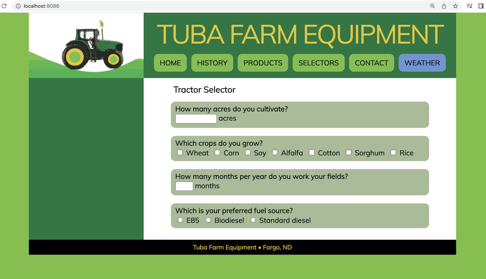

## FINAL PROJECT
### Overview
Part I of this project focuses on showing off basic skills to get started with dockers. I will be using dockerfile commands to create and run an image. inside Project 5 folder, you find website subdirectory which contains my website files. In this documentation, I will go over couple steps you need to take to run a website as container.

## PART I :  Dockerize it

+ **How to install docker + dependencies**
       
       
In order to build and run docker you must download a docker desktop software as a prerequisite. If you go to this website, you can download executable file depending on your system https://docs.docker.com/get-docker/

+ **How to build a container**
       

 This really depends on whether you are using dockerfile or command line to build your contanier. I used the earlier to complete this task. All I had to do was to chose the base image and version first in my FROM command, saved this file and run the following command to build it: 
   
            docker build -t my_apache2_image . 

+ **How to run the container**
  To run a container, you need to check if your image has installed by running docker images command, after confirming I ran this command to run my container and the same time binding the port:
      
      docker run -dit --name my_apache2_container -p 8080:80 my_apache2_image

+ How to view the project running in the container
  To view the website running in container, I just opened a new tab, and type localhost:8086 or private ip:8086

     NOTE: Make sure your dockerfile specifies the source and destination of your web content. Using COPY command, **/usr/local/apache2/htdocs/** should be the root directory where you need to store your website files.

  

## Part II : GitHub Actions and DockerHub

1. Process to create public repo in DockerHub
   
   + Create a Dorkerhub account at https://hub.docker.com/
   + Choose **Create repository**, give it a name and a description of what it does

2. How to authenticate with DockerHub via CLI using Dockerhub credentials
   
   + After your dockerhub  account is set up head to the settings and create new token under security tab.

   + Go to your CL and tag your image by using this command:
             
             docker tag your_image_name:version docherhub_username/your_repo_name:version
   
   If for any reason you would like to take your existing dockerhub image with a new version, use the following command
        
            docker build -t username/repo_name: new version -t username/repo_name: current version .

    + Log into Dockerhub using CLI. 
       
                 docker login -u  username
    This command will prompt for a password input. I highly recommend to use a token generated from tour dockerhub to avoid handing your username and password. 

3. How to push container to Dockerhub
Once your account is set up and you have authenticated you are ready to push you image. 
      
        docker push username/repo_name: version

4. Configuring GitHub Secrets
   + Go to your Github repository setting >> secrets >> actions >> new repository secrets. 
   + Set up your username and  passorword, I recommend your token for a password

5. Behavior of GitHub workflow

+ GitHub workflow is a set of actions that will execute when triggered by an event. Example of event is a push to github repo
+ USERNAME and PASSWORD are my custom variables, you can name yours anyhow

## Part III :  Deployment
 + My restart script is supposed to perform certain tasks when an event (in this case a push ) happens in my github repo.
  
 + Creating a listener
  
     1. First I downloaded and installed hookdeck from this website https://github.com/hookdeck/hookdeck-cli/releases/tag/v0.5
   
     2. I ran the following CLI command 
              hookdeck listen 8083. A guest account will be created for you if you dont have one yet. This command will prompt you to enter the source of webhook(say github), the the path webhooks will be forwared to(endpoint). Name your connection anyhow you like. After you finish these steps, a webhook URL will be provided for you. 
              
+ How to installed the webhook on GitHub
     1. Copy webhook URL provided
     2.  Go to your github repo settings, 
     3.  Click webhook and paste it. 
     4.  Create a secret and a type of event you want webhook to listen for, 
     5.  Save. On your CLI you will see a success message
   
+ How to keep the webhook running if the instance is on
     
     I created a service script in /etc/systemd folder and determined which services are prerequisite for my hookdeck service to run

+  Webhook task definition file
  
      This file with .json file has an ID that is coupled with the IP and port will form a link on which you can access your webhook. It is in this file where a path to a rertart file will be defined
  

+ Steps to set up a notifier in GitHub or DockerHub
   1. Click upper right corner on notification bell icon
   2. under the list of repositories, use the "Manage notifications"
   3. On the notifications settings page, choose how you receive notifications and on what type of events you want to be notified about 
   
## Part IV :  Diagramming

   
